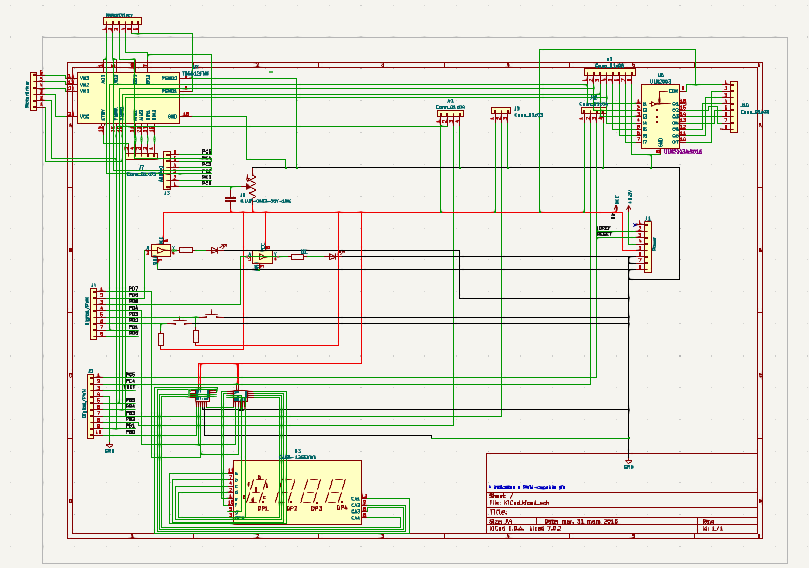
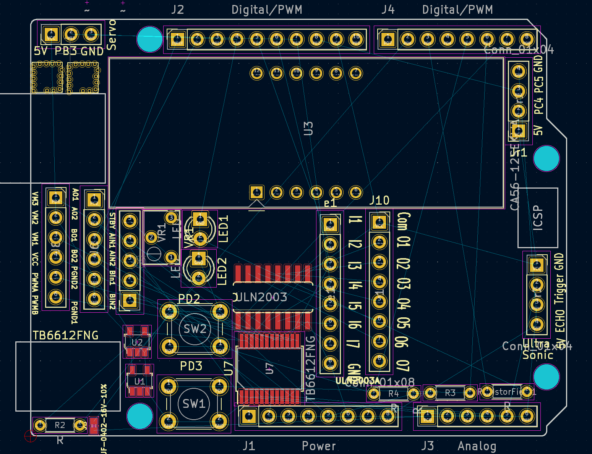
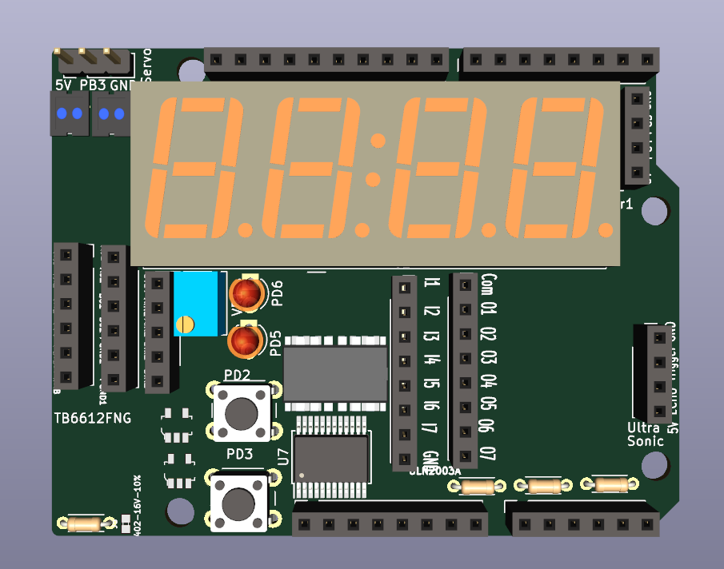
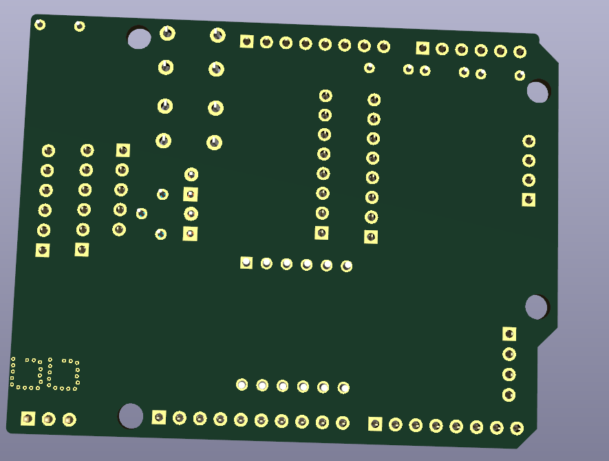

# KiCad-PCB-Design-Project

### COMPONENTS LIST AND CONNECTION BLOCK DIAGRAM w/ PINS ###
LEDs, Pushbuttons, Resistors, Capacitor, Potentiometer, 7-seg display, Shift Register, DC Motor
Driver, Stepper Motor, Ultrasonic sensor, I2C, Invertor, Connectors, Digital/PWM pins, Analog
pins, Female header pins, Male Header pins.
### Connections: ###
* PC4-PC5: I2C,
* PC0: POT,
* PD2, PD3: Pushbutton
* PD6, PD5: Led
* PB5-PB8: Shift Register
* U3: Seven Segment Display
* PB4, VCC, GND: Servo Motor
* PB0-PB3, VCC, GND: Stepper Motor
* PE4-PE7: Ultrasonic sensor
* PC6-9, VCC, GND: DC Motor Driver
* PC10-12, VCC, GND: MPU6050 sensor

### SCHEMATICS ####

### LAYOUT ###

### Front & Back ###

### Bill of Materials ###
 Id |           Designator         |              Footprint                              | Quality |     Designation    |          Description           |   Supplier and Ref. |
----| ---------------------------- | --------------------------------------------------- | ------- | ------------------ | ------------------------------ | ------------------- |
 1  |    J5                        |    402                                              |    1    | 0.1UF-0402-16V-10% | Capacitor                      |  Mouser Electronics |
 2  |    J1                        |    PinSocket_1x08_P2.54mm_Vertical                  |    1    | Power              | VCC, 5Vv, 3V, GND              |  Amazon             |
 3  |    J3                        |    PinSocket_1x06_P2.54mm_Vertical                  |    1    | Analog             | Analog                         |  Amazon             |
 4  |    J2                        |    PinSocket_1x10_P2.54mm_Vertical                  |    1    | Digital/PWM        | PB Port, Digital/PWM           |  Amazon             |
 5  |    J4                        |    PinSocket_1x08_P2.54mm_Vertical                  |    1    | Digital/PWM        | PD Port, Digital/PWM           |  Amazon             |
 6  |   JR1,JR2                    |    PinSocket_1x04_P2.54mm_Vertical                  |    2    | Conn_01x04         | PE Port, Ultrasonic Connector  |  Amazon             |
 7  |   R4, R2, ResistorField, R3  |    R_Axial_DIN0204_L3.6mm_D1.6mm_P5.08mm_Horizontal |    4    | 10k Ohms           | Resistors                      |  Amazon             |
 8  |    J9                        |    PinHeader_1x03_P2.54mm_Vertical                  |    1    | Conn_01x03         | PQ Port                        |  Amazon             |
 9  |    U3                        |    CA56-12SEKWA                                     |    1    | CA56_12SEKWA       | Seven Seg.                     |  Arrow Electronics  |
 10 |    J8,J6                     |    PinSocket_1x06_P2.54mm_Vertical                  |    2    | MotorDriver        | DC Motor Driver                |  Amazon             |
